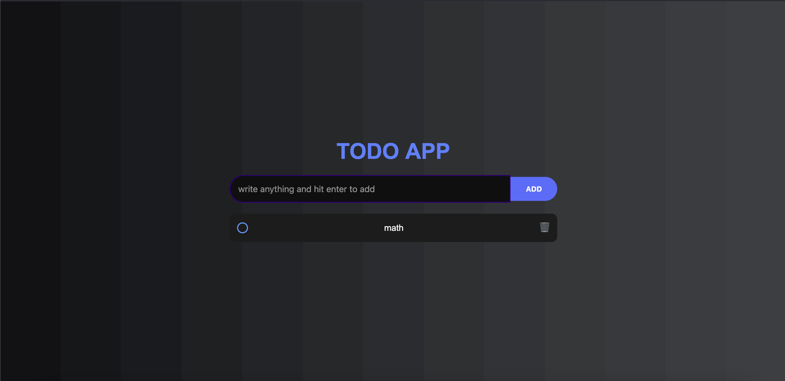

# ✅ Todo App

A simple and stylish **Todo App** built with **HTML, CSS, and JavaScript**.  
You can add, complete, and delete tasks with a modern UI featuring a gradient background.

---

## 🚀 Features
- Add tasks with **Enter** key or **Add button**
- Mark tasks as **completed** (circle fills + strikethrough)
- Delete tasks with a trash icon
- Responsive layout
- Gradient background theme

---

## 📸 Preview
  

---

## 🛠️ Technologies Used

* **HTML5** – Structure
* **CSS3** – Styling (gradient)
* **JavaScript (ES6)** – Functionality

---

